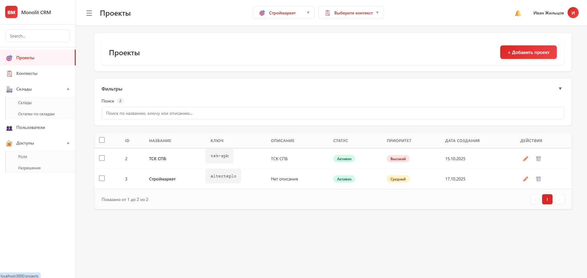
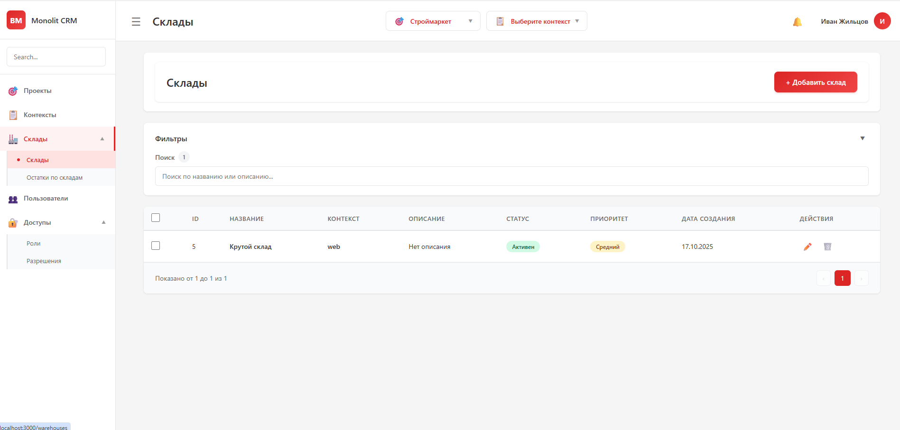
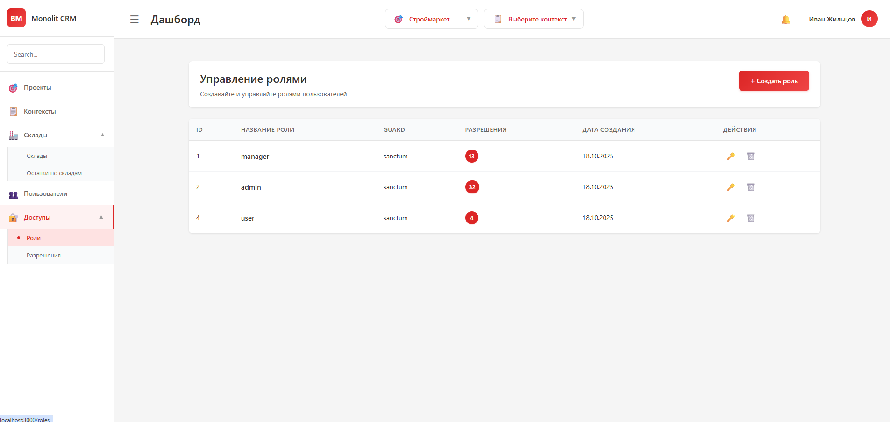
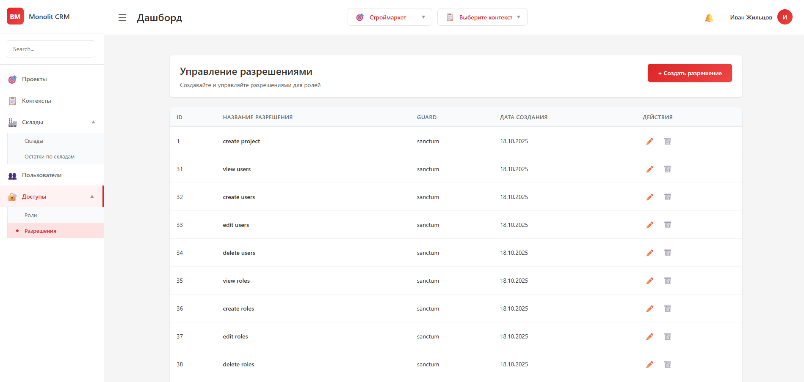
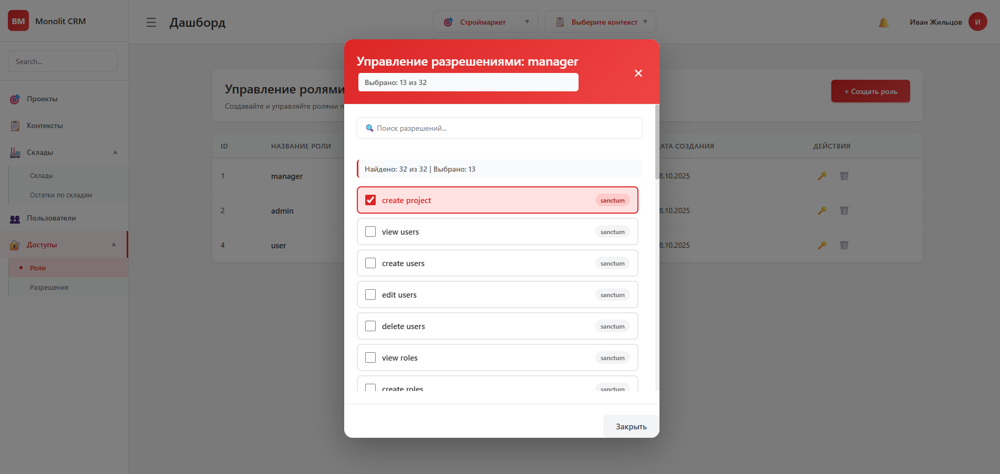

<div align="center">

# 🏢 CRM-система Monolit

[](https://laravel.com)
[](https://reactjs.org)
[](https://php.net)
[]()

**Современная система управления проектами, складами и пользователями**

*Полнофункциональная CRM-система с системой ролей, real-time уведомлениями и интуитивным интерфейсом*

</div>

## 📸 Скриншоты системы

### 🎯 Управление проектами

*Интерфейс управления проектами с возможностью создания, редактирования и фильтрации*

### 🏪 Управление складами

*Система управления складами с привязкой к контекстам и проектам*

### 👥 Система ролей

*Управление ролями пользователей с назначением разрешений*

### 🔐 Управление разрешениями

*Детальная настройка разрешений для контроля доступа к функциям*

### 🛡️ Дополнительные разрешения

*Расширенное управление правами доступа пользователей*

---

## 🚀 Быстрый старт

| Действие | Команда |
|----------|---------|
| **Установка** | `composer install && cd frontend && npm install` |
| **Запуск** | `composer run dev` |
| **Миграции** | `php artisan migrate` |
| **Тесты** | `composer run test` |
| **Документация API** | `http://localhost:8000/api/documentation` |

## 📋 Содержание

- [🚀 Технологический стек](#-технологический-стек)
- [📋 Основной функционал](#-основной-функционал)
- [🏗️ Архитектура системы](#️-архитектура-системы)
- [🚀 Установка и запуск](#-установка-и-запуск)
- [📁 Структура проекта](#-структура-проекта)
- [🔧 API Endpoints](#-api-endpoints)
- [🎨 Особенности интерфейса](#-особенности-интерфейса)
- [🔐 Безопасность](#-безопасность)
- [🧪 Тестирование](#-тестирование)
- [🚀 Развертывание](#-развертывание)

---

## 🚀 Технологический стек

### Backend
- **Laravel 12** - PHP фреймворк
- **Laravel Sanctum** - API аутентификация
- **Spatie Laravel Permission** - система ролей и разрешений
- **Laravel Reverb** - WebSocket сервер для real-time уведомлений
- **L5-Swagger** - автоматическая генерация API документации
- **PHP 8.2+** - язык программирования

### Frontend
- **React 18** - библиотека для построения UI
- **React Router 6** - маршрутизация
- **Axios** - HTTP клиент для API запросов
- **Laravel Echo** - WebSocket клиент для real-time уведомлений
- **Vite** - сборщик и dev-сервер
- **Tailwind CSS** - CSS фреймворк

### База данных
- **MySQL/PostgreSQL** - основная база данных
- **SQLite** - для разработки и тестирования

## 📋 Основной функционал

### 👥 Управление пользователями
- ✅ Регистрация и аутентификация пользователей
- ✅ Система ролей (admin, manager, user)
- ✅ Система разрешений с детальным контролем доступа
- ✅ Управление ролями и разрешениями пользователей
- ✅ Real-time уведомления

### 📊 Управление проектами
- ✅ CRUD операции с проектами
- ✅ Поля: название, ключ, описание, статус, приоритет
- ✅ Поиск и фильтрация проектов
- ✅ Связь с контекстами

### 🎯 Управление контекстами
- ✅ CRUD операции с контекстами
- ✅ Привязка к проектам (обязательная связь)
- ✅ Поля: название, ключ, описание, проект, статус, приоритет
- ✅ Поиск и фильтрация контекстов

### 🏪 Управление складами
- ✅ CRUD операции со складами
- ✅ Привязка к контекстам (обязательная связь)
- ✅ Поля: название, описание, контекст, статус, приоритет
- ✅ Управление остатками на складах
- ✅ Отдельная страница для управления остатками

### 📦 Управление остатками
- ✅ CRUD операции с остатками
- ✅ Поля: склад, категория, мин. количество, макс. количество
- ✅ Фильтрация по складу и категории
- ✅ Отдельная страница для удобного управления

## 🏗️ Архитектура системы

### Иерархия данных
```
Проект (Project)
    └── Контекст (Context)
        └── Склад (Warehouse)
            └── Остаток (WarehouseStock)
```

### Система ролей
- **Admin** - полный доступ ко всем функциям
- **Manager** - управление проектами, контекстами, складами и остатками
- **User** - только просмотр данных

## 🚀 Установка и запуск

### Предварительные требования
- PHP 8.2+
- Composer
- Node.js 16+
- MySQL/PostgreSQL или SQLite

### 1. Клонирование репозитория
```bash
git clone <repository-url>
cd api-monolit.local
```

### 2. Установка зависимостей
```bash
# Backend зависимости
composer install

# Frontend зависимости
cd frontend
npm install
cd ..
```

### 3. Настройка окружения
```bash
# Копирование файла окружения
cp .env.example .env

# Генерация ключа приложения
php artisan key:generate

# Настройка базы данных в .env файле
# DB_CONNECTION=mysql
# DB_HOST=127.0.0.1
# DB_PORT=3306
# DB_DATABASE=your_database_name
# DB_USERNAME=your_username
# DB_PASSWORD=your_password
```

### 4. Настройка базы данных
```bash
# Запуск миграций
php artisan migrate

# Заполнение базы тестовыми данными (опционально)
php artisan db:seed

# Создание ролей и разрешений
php artisan db:seed --class=RolesAndPermissionsSeeder
```

### 5. Запуск приложения

#### Режим разработки (рекомендуется)
```bash
# Запуск всех сервисов одной командой
composer run dev
```

Эта команда запустит:
- Laravel API сервер (http://localhost:8000)
- Laravel Queue Worker
- Laravel Pail (логи)
- React dev сервер (http://localhost:3000)

#### Ручной запуск
```bash
# Терминал 1 - Laravel API
php artisan serve

# Терминал 2 - Laravel Queue Worker
php artisan queue:work

# Терминал 3 - React Frontend
cd frontend
npm run dev
```

### 6. Доступ к приложению
- **Frontend**: http://localhost:3000
- **API**: http://localhost:8000
- **API Документация**: http://localhost:8000/api/documentation

## 📁 Структура проекта

```
app/
├── app/
│   ├── Http/Controllers/     # API контроллеры
│   ├── Models/              # Eloquent модели
│   ├── Services/            # Бизнес-логика
│   ├── Events/              # События системы
│   └── Dto/                 # Data Transfer Objects
├── database/
│   ├── migrations/          # Миграции базы данных
│   ├── seeders/            # Сидеры для тестовых данных
│   └── factories/          # Фабрики для тестирования
├── frontend/               # React приложение
│   ├── src/
│   │   ├── api/            # API клиенты
│   │   ├── components/     # React компоненты
│   │   ├── pages/          # Страницы приложения
│   │   ├── context/        # React Context
│   │   └── utils/          # Утилиты
│   └── package.json
├── routes/
│   └── api.php             # API маршруты
├── config/                 # Конфигурационные файлы
└── tests/                  # Тесты
```

## 🔧 API Endpoints

### Аутентификация
- `POST /api/auth/register` - регистрация пользователя
- `POST /api/auth/login` - вход в систему

### Пользователи
- `GET /api/users` - список пользователей
- `POST /api/users` - создание пользователя
- `PUT /api/users/{id}` - обновление пользователя
- `DELETE /api/users/{id}` - удаление пользователя
- `POST /api/users/roles/add` - назначение роли пользователю
- `DELETE /api/users/roles/remove` - удаление роли у пользователя

### Проекты
- `GET /api/projects` - список проектов
- `POST /api/projects` - создание проекта
- `PUT /api/projects/{id}` - обновление проекта
- `DELETE /api/projects/{id}` - удаление проекта
- `GET /api/projects/{id}/contexts` - контексты проекта

### Контексты
- `GET /api/contexts` - список контекстов
- `POST /api/contexts` - создание контекста
- `PUT /api/contexts/{id}` - обновление контекста
- `DELETE /api/contexts/{id}` - удаление контекста

### Склады
- `GET /api/warehouses` - список складов
- `POST /api/warehouses` - создание склада
- `PUT /api/warehouses/{id}` - обновление склада
- `DELETE /api/warehouses/{id}` - удаление склада

### Остатки на складах
- `GET /api/warehouse-stocks` - список остатков
- `POST /api/warehouse-stocks` - создание остатка
- `PUT /api/warehouse-stocks/{id}` - обновление остатка
- `DELETE /api/warehouse-stocks/{id}` - удаление остатка

### Роли и разрешения
- `GET /api/roles` - список ролей
- `POST /api/roles` - создание роли
- `DELETE /api/roles/{id}` - удаление роли
- `GET /api/permissions` - список разрешений
- `POST /api/permissions` - создание разрешения

### Уведомления
- `POST /api/notifications/send` - отправка системного уведомления
- `POST /api/notifications/send-to-user/{userId}` - отправка персонального уведомления

## 🎨 Особенности интерфейса

### Дизайн
- ✅ Современный и чистый интерфейс
- ✅ Красная цветовая схема (#dc2626) в стиле бренда
- ✅ Адаптивный дизайн для всех устройств
- ✅ Плавные анимации и переходы

### Навигация
- ✅ Боковое меню с иконками
- ✅ Выпадающие подменю для связанных разделов
- ✅ Хлебные крошки для навигации
- ✅ Активные состояния пунктов меню

### Таблицы и формы
- ✅ Таблицы с сортировкой и фильтрацией
- ✅ Модальные окна для создания/редактирования
- ✅ Валидация форм на клиенте и сервере
- ✅ Hover-эффекты и интерактивность

## 🔐 Безопасность

### Аутентификация
- Laravel Sanctum для API токенов
- Защищенные маршруты middleware
- Автоматическое обновление токенов

### Авторизация
- Система ролей и разрешений Spatie
- Middleware для проверки прав доступа
- Детальный контроль доступа к функциям

### Валидация
- Валидация на уровне Request классов
- Санитизация входных данных
- Защита от SQL инъекций

## 🧪 Тестирование

### Запуск тестов
```bash
# Все тесты
composer run test

# Только unit тесты
php artisan test --testsuite=Unit

# Только feature тесты
php artisan test --testsuite=Feature
```

### Покрытие тестами
- Unit тесты для моделей и сервисов
- Feature тесты для API endpoints
- Тесты аутентификации и авторизации

## 📊 Мониторинг и логирование

### Логирование
- Laravel Pail для просмотра логов в реальном времени
- Структурированные логи для отладки
- Логирование API запросов и ошибок

### Уведомления
- Real-time уведомления через WebSocket
- Email уведомления (настраивается)
- Системные и персональные уведомления

## 🚀 Развертывание

### Продакшен сборка
```bash
# Backend
composer install --optimize-autoloader --no-dev
php artisan config:cache
php artisan route:cache
php artisan view:cache

# Frontend
cd frontend
npm run build
```

### Переменные окружения для продакшена
```env
APP_ENV=production
APP_DEBUG=false
DB_CONNECTION=mysql
QUEUE_CONNECTION=database
REVERB_APP_ID=your_app_id
REVERB_APP_KEY=your_app_key
REVERB_APP_SECRET=your_app_secret
```

## 🤝 Разработка

### Стандарты кодирования
- PSR-12 для PHP кода
- ESLint для JavaScript/React
- Prettier для форматирования

### Git workflow
- Feature branches для новой функциональности
- Pull requests для code review
- Conventional commits для истории изменений

### Добавление новой функциональности
1. Создайте feature branch
2. Добавьте миграции если нужно
3. Создайте модели и контроллеры
4. Добавьте API endpoints
5. Создайте React компоненты
6. Напишите тесты
7. Создайте pull request

## 📝 Документация

### API документация
- Автоматически генерируется через L5-Swagger
- Доступна по адресу `/api/documentation`
- Обновляется при изменении API

### Дополнительная документация
- `frontend/README.md` - документация фронтенда
- `frontend/QUICK_START.md` - быстрый старт
- `frontend/SETUP.md` - детальная настройка

## 🐛 Известные проблемы и решения

### CORS ошибки
Убедитесь что в `config/cors.php` добавлен ваш домен:
```php
'allowed_origins' => ['http://localhost:3000', 'https://yourdomain.com'],
```

### Проблемы с WebSocket
Проверьте настройки Reverb в `.env`:
```env
REVERB_APP_ID=your_app_id
REVERB_APP_KEY=your_app_key
REVERB_APP_SECRET=your_app_secret
REVERB_HOST="localhost"
REVERB_PORT=8080
REVERB_SCHEME=http
```

### Проблемы с очередями
Убедитесь что queue worker запущен:
```bash
php artisan queue:work
```

## 📄 Лицензия

Публичный проект Monolit CRM. Все права защищены.

## 👥 Команда разработки

- **Backend**: Laravel, PHP
- **Frontend**: React, JavaScript
- **DevOps**: Docker, CI/CD
- **QA**: PHPUnit, Jest

---

**Версия**: 1.0.0  
**Последнее обновление**: 2025-01-27  
**Статус**: В активной разработке
